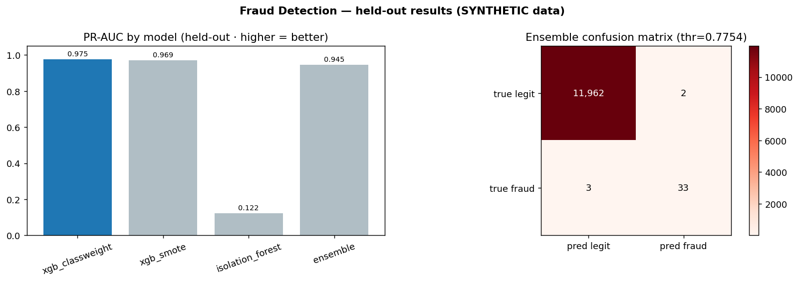

# 💳 Real-Time Credit-Card Fraud Detection

> Anomaly detection on a **severely imbalanced** dataset (0.17% fraud) — SMOTE vs class-weighting compared, an XGBoost + Isolation Forest ensemble, **SHAP** explanations for every alert, and a **real-time streaming** scorer (WebSocket API + live dashboard). Built for the fintech/bank hiring bar (ANZ, CBA, NAB, Afterpay, Zip).

[](https://github.com/Sanny-Un-Sowadh-Wamik/realtime-fraud-detection/actions/workflows/ci.yml)


[](https://sanny2005-realtime-fraud-detection.hf.space)

**🔴 Live demos (no login):** **[▶ Live dashboard](https://sanny2005-realtime-fraud-detection.hf.space)** · **[🛡️ Scoring API `/docs`](https://sanny2005-fraud-detection-api.hf.space/docs)** — both on Hugging Face Spaces _(running on synthetic data — see Results)_

---

## 🎯 What this project demonstrates

- **Imbalanced learning done right** — SMOTE applied **only to the training fold** (the #1 leakage mistake, avoided and documented), compared against XGBoost `scale_pos_weight`.
- **The right metrics** — precision/recall, **PR-AUC** and ROC-AUC (not accuracy — 99.8% accuracy is trivial here), with threshold selection at a business operating point.
- **Ensemble** — supervised XGBoost + unsupervised Isolation Forest (catches novel fraud with no labels) combined by a weighted score.
- **Explainability** — SHAP waterfall per flagged transaction + a global summary (essential for fintech model risk/compliance).
- **Real-time** — a streaming simulator scores transactions live over a FastAPI **WebSocket**, surfaced on a Streamlit dashboard (ALERT / REVIEW / OK).

## 🏗️ Architecture

```mermaid
flowchart LR
    A[OpenML ULB dataset<br/>284,807 tx · 0.17% fraud] --> B[Preprocess<br/>scale Amount/Time]
    B --> C{Train (SMOTE on train only)}
    C --> D1[XGBoost<br/>scale_pos_weight]
    C --> D2[Isolation Forest<br/>unsupervised]
    D1 & D2 --> E[Weighted ensemble<br/>+ SHAP explainer]
    E --> F[MLflow registry]
    F --> G[Stream scorer<br/>FastAPI WebSocket]
    G --> H[Streamlit live dashboard<br/>feed · gauge · SHAP]
```

## 🧰 Tech stack

| Layer | Tool |
|---|---|
| Data (keyless) | OpenML (`fetch_openml`) → Parquet |
| Imbalance | `imbalanced-learn` (SMOTE) + XGBoost `scale_pos_weight` |
| Models | XGBoost + Isolation Forest ensemble |
| Explainability | SHAP |
| Streaming | in-process async queue (Redis/Upstash-swappable) + FastAPI WebSockets |
| Dashboard | Streamlit + Plotly |
| Tracking / CI | MLflow · `uv` · `ruff` · `pytest` · GitHub Actions |
| Hosting (free) | Hugging Face Spaces |

## 📁 Project structure

```
02-fraud-detection/
├── config/config.yaml          # data + model + serving params (typed)
├── src/frauddet/
│   ├── data/load.py            # keyless OpenML load + stratified sample
│   ├── features/               # preprocessing / scaling
│   ├── models/                 # SMOTE, XGBoost, IsolationForest, ensemble, eval, SHAP
│   └── stream/                 # transaction stream + live scorer
├── api/                        # FastAPI + WebSocket
├── dashboard/                  # Streamlit live dashboard
├── scripts/                    # build_dataset, train, deploy
├── tests/ · .github/workflows/ · Dockerfile · Makefile
```

## 🚀 Quickstart

```bash
uv venv --python 3.11
uv pip install -e ".[models,api,app,dev]"
python scripts/build_dataset.py     # fetch (keyless) + cache + sample
python scripts/train.py             # train, evaluate, log to MLflow
```

## 📊 Results



> ⚠️ **Data note:** OpenML (the keyless source) was mid-outage during this build, so the numbers below are a **pipeline validation on a synthetic, deliberately-separable dataset** — they are inflated and **not** representative of the real problem. The loader auto-fetches the real 284,807-row ULB dataset the moment OpenML responds; `python scripts/build_dataset.py && python scripts/train.py` then replaces these. `data_is_real: false` in `models/metadata.json` and a banner in the live dashboard make the distinction explicit.

Held-out test set; threshold chosen to maximise F1. **PR-AUC is the headline** (accuracy is meaningless at this prevalence):

| Model | PR-AUC | ROC-AUC | Precision | Recall | FP | FN |
|---|--:|--:|--:|--:|--:|--:|
| Baseline (predict legit) | 0.003 | 0.500 | 0.00 | 0.00 | 0 | 36 |
| **XGBoost (class-weight)** | 0.975 | 1.000 | 0.97 | 0.92 | 1 | 3 |
| XGBoost (SMOTE) | 0.969 | 1.000 | 0.88 | 0.97 | 5 | 1 |
| Isolation Forest (unsup.) | 0.123 | 0.941 | 0.26 | 0.28 | 28 | 26 |
| Ensemble (served) | 0.945 | 0.999 | 0.94 | 0.92 | 2 | 3 |

**What the comparison teaches (and this holds on real data):**
- **Accuracy is a trap** — the baseline is 99.7% "accurate" yet catches zero fraud. PR-AUC exposes it instantly.
- **SMOTE vs class-weighting is a real trade-off** — SMOTE caught one extra fraud (recall ↑) at **5× the false positives** (precision ↓). The choice depends on the cost of a missed fraud vs a blocked legitimate customer.
- **Isolation Forest** alone is weak (unsupervised) but flags novel patterns with no labels — useful as an ensemble member and cold-start fallback.
- **SHAP** explains every alert (in the dashboard) — non-negotiable for fintech model-risk sign-off.

### 📌 Résumé bullet
> Built a real-time credit-card fraud detector on a 0.17%-prevalence dataset: compared SMOTE vs class-weighting leakage-free (SMOTE on the train fold only), combined XGBoost + Isolation Forest into an ensemble, explained every alert with SHAP, and served it via a FastAPI WebSocket stream + live Streamlit dashboard with MLflow tracking and GitHub Actions CI — on $0 free-tier infrastructure.

## 📄 License

MIT — © 2026 Sanny Un Sowadh Wamik
